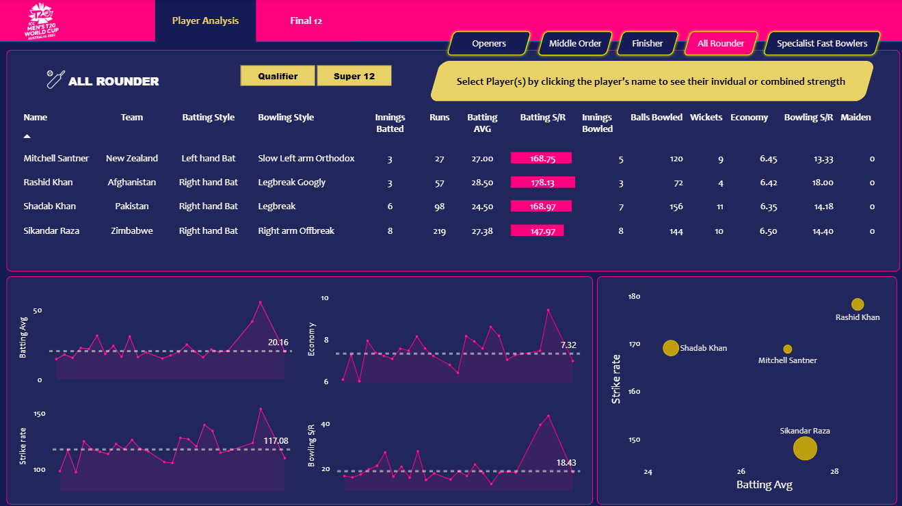
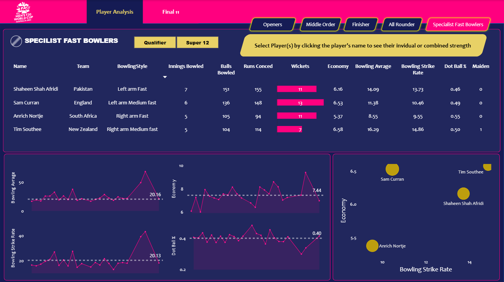
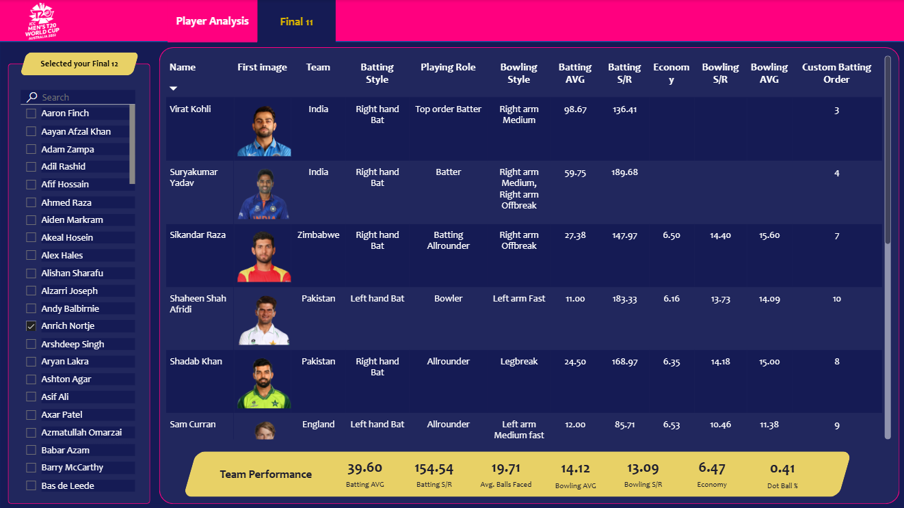
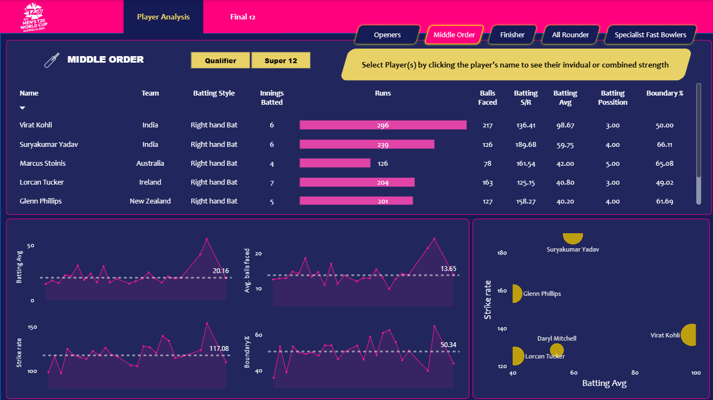
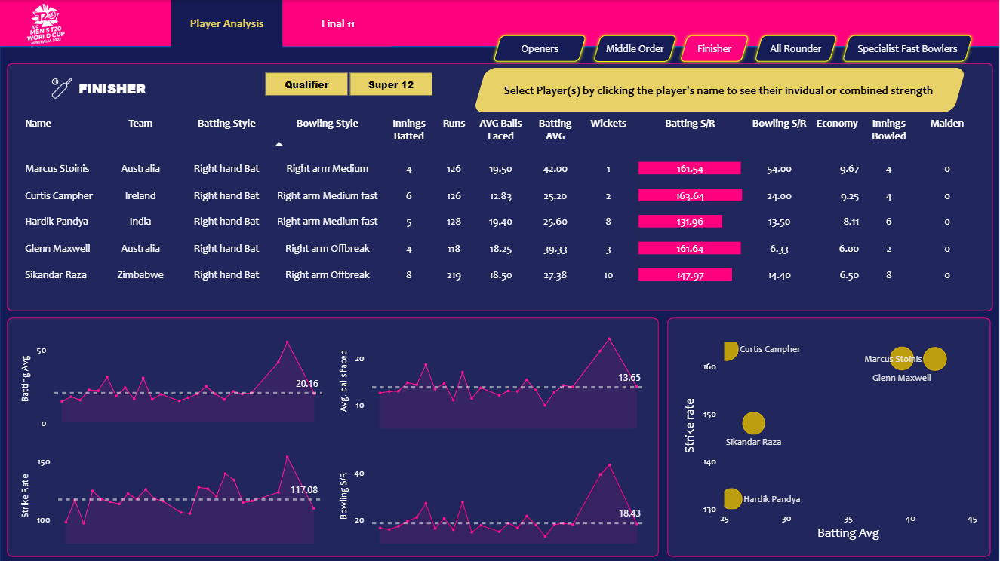
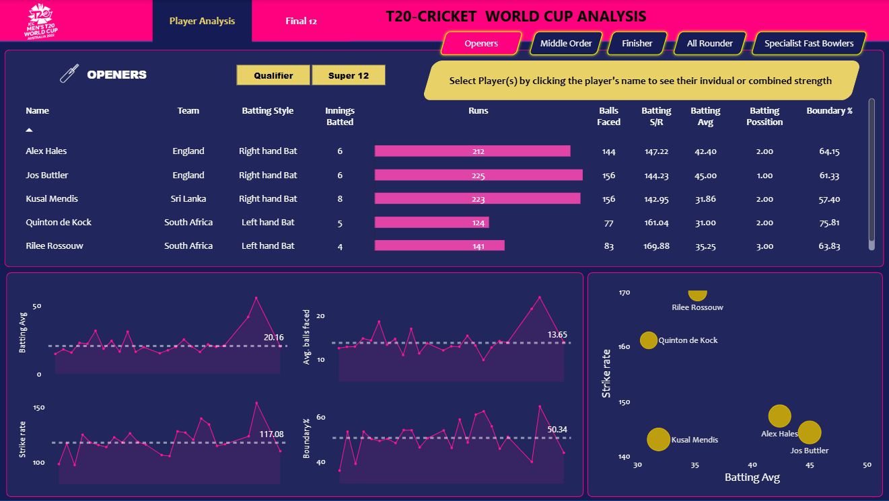

# 🏏 T20 Men's Cricket World Cup 2022 - Player Performance Analysis Dashboard

An **interactive Power BI dashboard** highlighting the **Best XI** from the **T20 World Cup 2022**, covering top openers, middle-order players, all-rounders, and tail-enders. Designed for **intuitive exploration of player statistics** and made publicly available via `.pbix` for learning and analysis.

---

## 📊 Dashboard Overview

The dashboard allows users to:

- Explore the **Best Playing XI** selected dynamically using performance metrics.
- Analyze player roles: **openers**, **middle-order batsmen**, **all-rounders**, and **tail-enders**.
- View batting and bowling statistics with KPIs such as:
  - Batting Average
  - Strike Rate
  - Economy Rate
  - Dot Ball %
  - Boundary %
- Compare performance across teams and roles.
- Use slicers to filter by **team**, **player role**, or **match**.

 <!-- Replace with your actual image path -->

---

## 🔧 Tools & Technologies

| Tool             | Purpose                                     |
|------------------|---------------------------------------------|
| **Power BI**      | Data visualization & dashboard development  |
| **Python**        | Web scraping, data cleaning & transformation |
| **Beautiful Soup**| Scraping player stats from ESPN CricInfo    |
| **Pandas**        | Data manipulation & CSV generation          |
| **Jupyter Notebook** | Scripting data extraction & transformation |
| **DAX**           | Calculated fields and KPI logic             |
| **Power Query**   | Data shaping and model creation             |

---

## 🗂️ Data Source

- **Primary Source:** [ESPNCricinfo.com](https://www.espncricinfo.com/)
- **Scraping Framework:** Python’s `BeautifulSoup`
- **Proxy Handling:** [BrightData](https://brightdata.com/) (for robust scraping)

---

## 📈 Key Features

### ⭐ Best XI Highlight
- Built using **DAX logic** to pick top-performing players per role.
- Balanced team with top 2 openers, 3 middle-order players, 3 all-rounders, and 3 tail-enders.

### 📌 KPIs & Performance Metrics
- Batting: Average, Strike Rate, Boundary %, Runs Scored
- Bowling: Economy Rate, Dot Ball %, Wickets Taken
- Dynamic filters and visual highlights for each role

### 🔍 Interactivity
- Slicers to filter by:
  - Team
  - Player Role
  - Match
- Hover tooltips for detailed metrics
- Tab-based report for Batting, Bowling, Team Stats, Best XI

---

## 🧪 Data Workflow

1. **Scraping Player Data**
   - Used Python + BeautifulSoup to scrape JSON data from player profile and match pages.

2. **Data Transformation**
   - Parsed and structured into CSV using Pandas in Jupyter Notebook.

3. **Power BI Modeling**
   - Data imported into Power BI via Power Query.
   - Primary keys like `PlayerID`, `TeamID`, `MatchID` used to create relationships.

4. **Visualization & DAX**
   - Created measures using DAX for KPIs.
   - Developed report pages with filters and role-based visuals.

---
## 📸 Screenshots

| All Rounder |
| --------------- |
||

| Fast Bolwers |
| --------------- |
||

| Final Best 11 Players |
| --------------- |
||

| Middle Order |
 | --------------- |
||

| Finisher |
 | --------------- |
||

| Openers |
  | --------------- | 
||

